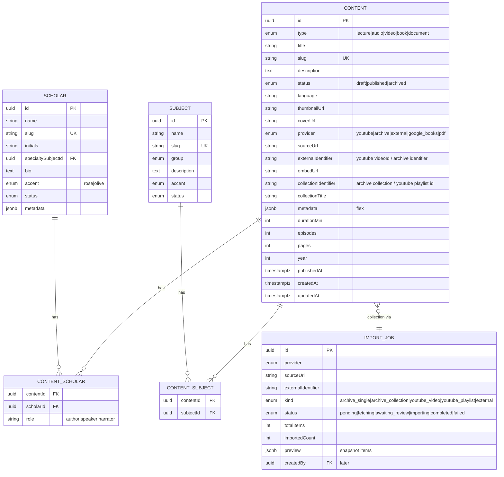
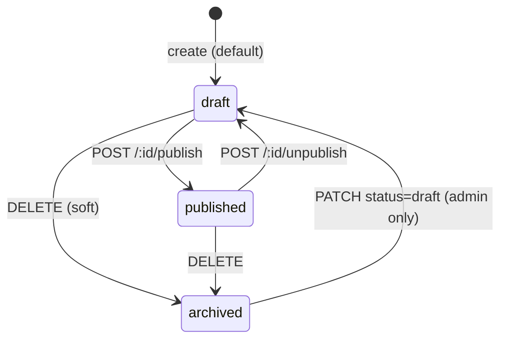

# ilmNet Backend Architectuur — Generic Content Model

> **Status:** Design / Contract — nog geen code. Frontend is uitgangspunt, geen breaking changes.
> **Datum:** 2026-09-20 • **Stack voorstel:** TypeScript + Fastify + Prisma + PostgreSQL
> **Public:** gratis, zonder account • **Admin:** later auth (JWT), nu als `x-admin-preview` header voorbereid

---

## 1. Stack-keuze

### Gekozen: **Node.js 20 + Fastify + Prisma + PostgreSQL**

**Waarom Fastify + Prisma en niet NestJS / Express / Python?**

| Eis | Fastify | Prisma + Postgres |
|---|---|---|
| Frontend is al TypeScript/React | Gedeelde types `Content`, `Scholar`, `Subject` tussen fe/be | Prisma genereert types 1:1 uit schema |
| Externe providers uitbreidbaar | Plugin-model (`fastify-plugin` per provider) | `provider` als enum + `metadata JSONB` |
| Archive.org bulk (100 items) | Streaming + `fastify-multipart` + job queue | JSONB + GIN-index, FTS, transacties |
| Zoeken/filteren public | Schema-validatie met Zod/TypeBox | Postgres FTS + index op `status=published` |
| Auth later, public nu open | `preHandler` hook `requireAdmin` (nu no-op) | RL S later |

**Alternatieven overwogen:**
- **NestJS:** zwaarder, wel strak voor enterprise — pas als team >5. Fastify is 30% sneller en dunner.
- **Express:** prima, maar Fastify heeft out-of-the-box validatie + OpenAPI.
- **Python FastAPI:** prima voor scraping, maar type-sharing met React valt weg.

**Aanvullend:**
- **Validatie:** Zod (gedeeld met frontend)
- **Auth (later):** `fastify-jwt` + `argon2` + refresh tokens, `role: 'admin'`
- **Jobs:** BullMQ + Redis voor grote Archive-collecties / YouTube playlists (optioneel fase 2, nu sync met limiet 100)
- **Deploy:** Docker + migrate via `prisma migrate`
- **Testing:** Vitest + Supertest

> **Mappenstructuur voorstel:**
> ```
> /server
>   src/
>     modules/content/{content.routes.ts, content.service.ts, content.schema.ts}
>     modules/provider/{youtube.service.ts, archive.service.ts, provider.registry.ts}
>     modules/scholar/
>     modules/subject/
>     modules/import/{import.routes.ts, import.service.ts}
>     plugins/auth.ts (nu passthrough)
>     db/prisma/schema.prisma
> ```

---

## 2. Database — Generic Content Model

### Kernprincipe
**Geen `lectures` en `books` tabellen.** Eén `contents` tabel met `type` en `provider`. Archive.org en YouTube zijn *providers* die *meerdere* `contents` opleveren.

### ER-diagram (Mermaid)



### Prisma Schema (verkort, production-ready)

```prisma
// db/prisma/schema.prisma
generator client { provider = "prisma-client-js" }
datasource db { provider = "postgresql"; url = env("DATABASE_URL") }

enum ContentType { lecture  audio  video  book  document }
enum Provider   { youtube  archive  external  google_books  pdf }
enum ContentStatus { draft  published  archived }
enum SubjectGroup { Revelation  Practice  Belief  History  Language  Character }

model Scholar {
  id         String   @id @default(cuid())
  slug       String   @unique
  name       String
  initials   String?
  specialtyId String?
  specialty  Subject? @relation(fields: [specialtyId], references: [id])
  bio        String?  @db.Text
  accent     String?  // rose | olive
  status     ContentStatus @default(published)
  metadata   Json?
  createdAt  DateTime @default(now())
  updatedAt  DateTime @updatedAt
  contents   ContentScholar[]
  @@index([status])
}

model Subject {
  id          String   @id @default(cuid())
  slug        String   @unique
  name        String
  group       SubjectGroup
  description String?  @db.Text
  accent      String?  // rose | olive | plain
  status      ContentStatus @default(published)
  metadata    Json?
  createdAt   DateTime @default(now())
  updatedAt   DateTime @updatedAt
  contents    ContentSubject[]
  scholars    Scholar[]
}

model Content {
  id                   String        @id @default(cuid())
  type                 ContentType
  title                String
  slug                 String        @unique
  description          String?       @db.Text
  status               ContentStatus @default(draft)
  language             String?       // "English", "Arabic / English"
  thumbnailUrl         String?
  coverUrl             String?
  provider             Provider
  sourceUrl            String        // canonical external url
  externalIdentifier   String?       // youtube: dQw4w... / archive: ilmnet-xxx-001
  embedUrl             String?
  collectionIdentifier String?       // archive collection id / youtube playlist id
  collectionTitle      String?
  durationMin          Int?
  episodes             Int?          // voor series
  pages                Int?          // voor boeken
  year                 Int?
  publishedAt          DateTime?
  createdAt            DateTime      @default(now())
  updatedAt            DateTime      @updatedAt
  importJobId          String?
  importJob            ImportJob?    @relation(fields: [importJobId], references: [id])
  metadata             Json?         // ← alle flexibele velden
  scholars             ContentScholar[]
  subjects             ContentSubject[]

  @@index([status, publishedAt])
  @@index([type, provider])
  @@index([collectionIdentifier])
  @@index([provider, externalIdentifier])
  @@index([slug])
  // FTS: @@index([title, description]) via raw SQL GIN + tsvector
}

model ContentScholar {
  contentId String
  scholarId String
  role      String? // author, speaker
  content   Content @relation(fields: [contentId], references: [id], onDelete: Cascade)
  scholar   Scholar @relation(fields: [scholarId], references: [id], onDelete: Cascade)
  @@id([contentId, scholarId])
}

model ContentSubject {
  contentId String
  content   Content @relation(fields: [contentId], references: [id], onDelete: Cascade)
  subjectId String
  subject   Subject @relation(fields: [subjectId], references: [id], onDelete: Cascade)
  @@id([contentId, subjectId])
}

model ImportJob {
  id                 String   @id @default(cuid())
  provider           Provider
  sourceUrl          String
  externalIdentifier String?
  kind               String   // archive_single | archive_collection | youtube_playlist | ...
  status             String   @default("pending") // pending | fetching | awaiting_review | importing | completed | failed
  totalItems         Int?
  importedCount      Int?     @default(0)
  preview            Json?    // snapshot van gedetecteerde items voor review
  error              String?  @db.Text
  createdBy          String?  // userId later
  createdAt          DateTime @default(now())
  updatedAt          DateTime @updatedAt
  contents           Content[]
  @@index([status, provider])
}
```

### Belangrijke kolommen verklaard

| Veld | Waarom |
|---|---|
| `contents.type` | Generiek: `lecture/audio/video/book/document` — *niet* tabel per type |
| `provider` | `youtube / archive / external / google_books / pdf` — uitbreidbaar via enum + registry |
| `externalIdentifier` | YouTube `videoId` / Archive `identifier` — stabiel, voor deduplicatie |
| `embedUrl` | Berekend bij write (`youtube → /embed/...`, `archive → /embed/...`) |
| `collectionIdentifier` | `archive collection id` of `youtube playlist id` — groep van 100 items terug te vinden |
| `metadata JSONB` | Alles wat Archive.org levert zonder kolom-explosie: `available_media:['MP3','Ogg']`, `creator`, `duration:'42:15'`, `size`, `publisher`, `mediatype`, `collection`, `subjectHint[]`, `archive_raw` |
| `status` + `publishedAt` | Single source of truth voor public visibility |
| `ContentScholar` / `ContentSubject` | Many-to-many, meerdere scholars/subjects per content (vereiste) |

**Archive.org specifiek (in `metadata` + denormalized kolommen):**

```json
{
  "archive": {
    "identifier": "ilmnet-audio-100-042",
    "collection": "ilmnet-collection-demo",
    "mediatype": "audio",
    "available_media": ["MP3", "Ogg Vorbis", "Flac"],
    "creator": "Shaykh Usman Rahman",
    "date": "2024-03-12",
    "year": 2024,
    "language": "English / Arabic",
    "duration": "38:42",
    "size": "42.1 MB",
    "subjectHint": "tafsir",
    "raw": { /* volledige archive.org/metadata response */ }
  }
}
```

**Indexen:** GIN op `metadata`, `tsvector` op `title+description` voor public search, aparte index op `status='published'` (public leest alleen published).

---

## 3. Alle Entities & Relaties (samengevat)

- **Scholar** 1—N **ContentScholar** N—1 **Content**
- **Subject** 1—N **ContentSubject** N—1 **Content**
- **ImportJob** 1—N **Content** (optioneel, voor herkomst van bulk)
- **Content** self: `collectionIdentifier` groepeert 100 items zonder extra tabel (of via `ImportJob`)

Geen aparte `Lecture`/`Book` tabellen — `type` bepaalt weergave. Frontend kan filteren op `type` of `provider`.

---

## 4. API Contract (REST, JSON, versie `/api/v1`)

### Conventies
- `GET` public → alleen `status=published`; admin → alle statuses (later via `Authorization: Bearer <jwt>`). Nu: `x-admin-preview: 1` als feature-flag.
- Pagination: `?page=1&limit=20&sort=updatedAt:desc`
- Filtering: `?type=lecture,audio&q=tafsir&provider=archive&scholar=s1&subject=tafsir&status=draft&language=English`
- Errors: `{ error: { code, message, details } }`
- Slugs: `title → slug` (bijv. `opening-the-quran-surat-al-fatiha`)

### 4.1 Admin

**Base:** `/api/v1/admin`

| Methode | Endpoint | Doel |
|---|---|---|
| `POST` | `/contents` | **create content** — single |
| `GET` | `/contents` | **list/search/filter** admin (alle statuses, full-text, includes) |
| `GET` | `/contents/:id` | detail (admin ziet ook drafts) |
| `PATCH` | `/contents/:id` | **update content** (titel, scholar/subject, etc.) |
| `DELETE` | `/contents/:id` | **delete/archive** (soft → `archived`, hard optioneel) |
| `POST` | `/contents/:id/publish` | **publish** — validatie + `publishedAt=now()` |
| `POST` | `/contents/:id/unpublish` | **unpublish** — terug naar `draft` |
| `POST` | `/contents/bulk` | alternatieve bulk-create (voor frontend fallback) |
| `PATCH` | `/contents/bulk` | **bulk update** — `{ ids:[...], patch:{ status, subjectIds } }` |
| `DELETE` | `/contents/bulk` | **bulk archive/delete** |
| `POST` | `/imports/archive/preview` | **bulk import preview** — body `{ sourceUrl, limit? }` → detectie |
| `POST` | `/imports/archive/confirm` | **bulk import confirm** → creëert N contents |
| `POST` | `/imports/youtube/preview` | idem voor `youtube` playlist |
| `POST` | `/imports/youtube/confirm` |  |
| `GET` | `/imports/:jobId` | status van import job |
| `GET/POST/PUT/DELETE` | `/scholars`, `/scholars/:id` | beheer scholars |
| `GET/POST/PUT/DELETE` | `/subjects`, `/subjects/:id` | beheer subjects |

**Voorbeeld `POST /admin/contents`**
```json
{
  "type": "audio",
  "title": "Qur’ān Recitation — Jumuʿah Reflection",
  "description": "Friday reflection — Archive.org audio",
  "provider": "archive",
  "sourceUrl": "https://archive.org/details/ilmnet-jumuah-042",
  "externalIdentifier": "ilmnet-jumuah-042",
  "embedUrl": "https://archive.org/embed/ilmnet-jumuah-042",
  "language": "English",
  "thumbnailUrl": "https://...",
  "scholarIds": ["s1"],
  "subjectIds": ["tafsir","ethics"],
  "status": "draft",
  "metadata": {
    "archive": { "available_media": ["MP3","Ogg"], "creator": "Shaykh Usman Rahman", "duration": "28:15" }
  }
}
```
Response `201 { id, slug, ... }`

**Bulk import preview (Archive) — response exact zoals UI verwacht**
```json
POST /admin/imports/archive/preview
Body: { "sourceUrl": "https://archive.org/details/ilmnet-collection-demo", "limit": 100 }

Response 200:
{
  "jobId": "imp_abc123",
  "provider": "archive",
  "sourceUrl": "https://archive.org/details/ilmnet-collection-demo",
  "identifier": "ilmnet-collection-demo",
  "title": "Archive.org collection — ilmnet-collection-demo",
  "totalItems": 100,
  "kindsSummary": { "audio": 42, "video": 28, "book": 30 },
  "isCollection": true,
  "items": [
    {
      "identifier": "ilmnet-collection-demo-001",
      "archiveUrl": "https://archive.org/details/ilmnet-collection-demo-001",
      "embedUrl": "https://archive.org/embed/ilmnet-collection-demo-001",
      "title": "Opening the Path — Part 01",
      "kind": "audio",
      "mediaTypes": ["MP3","Ogg Vorbis"],
      "thumbnail": "https://...",
      "creator": "Shaykh Usman Rahman",
      "date": "2024-03-12",
      "language": "English",
      "description": "Audio recording...",
      "duration": "32:15"
    }
  ]
}
```

**Bulk confirm**
```json
POST /admin/imports/archive/confirm
Body: {
  "jobId": "imp_abc123",
  "items": [
    { "identifier":"ilmnet-collection-demo-001", "selected":true, "title":"Opening — Part 01", "type":"audio", "scholarIds":["s1"], "subjectIds":["tafsir"], "language":"English", "series":"Friday Reminders", "status":"draft" },
    { "identifier":"ilmnet-collection-demo-002", "selected":false },
    { "identifier":"ilmnet-collection-demo-003", "selected":true, "type":"video", "scholarIds":["s3"], "subjectIds":["usul"], "status":"published" }
  ]
}
Response: { "imported": 2, "ids": ["l_xyz","l_abc"], "jobStatus":"completed" }
```
Elk `selected:true` item → **1 Content record**.

### 4.2 Public (geen auth)

**Base:** `/api/v1`

| Methode | Endpoint | Doel |
|---|---|---|
| `GET` | `/contents` | **list published** — filter `type, provider, scholar, subject, q, language, year` |
| `GET` | `/contents/:slug` | **detail** (404 als draft) |
| `GET` | `/scholars` | lijst (alleen met published content, indien gewenst) |
| `GET` | `/scholars/:slug` | detail + hun published contents |
| `GET` | `/subjects` | lijst |
| `GET` | `/subjects/:slug` | detail |
| `GET` | `/search?q=...` | alias voor `/contents?q=` met FTS |

**Public list voorbeeld**
```
GET /api/v1/contents?type=audio,video&provider=archive&subject=tafsir&q=tafsir&page=1&limit=12
→ { data:[...], page, limit, total, totalPages }
```

**Scholar/subject shapes** identiek maar gefilterd op published counts.

### 4.3 Auth-voorbereiding
- Alle `/admin/*` routes hebben `preHandler: requireAdmin`. Nu is `requireAdmin` een no-op die `x-admin-preview` doorlaat; later checkt die `JWT.verify` + `payload.role==='admin'`.
- Public routes hebben géén guard.
- `ImportJob.createdBy` nu nullable, later gevuld met `request.user.id`.
- CORS: public `*`, admin alleen `ADMIN_ORIGIN` (later).

---

## 5. Archive.org Collections — Import Flow

**Doel:** 1 URL → N Content records, met review.

**Sequence:**

1. **Admin plakt URL** in `#/admin/archive-import` → `POST /imports/archive/preview { sourceUrl }`
2. **Backend `archive.service.ts`:**
   - `GET https://archive.org/metadata/<identifier>` → bepaal `mediatype` (collection vs single)
   - Als `mediatype==collection` of `isCollection:true` → `GET https://archive.org/advancedsearch.php?q=collection:(<id>)&fl=identifier&rows=100&page=1&output=json`
   - Voor elk `identifier` uit search (tot 100) → `GET https://archive.org/metadata/<identifier>` parallel (met concurrency 8, cache)
   - Map elk naar `ArchiveDetectedItem` (zie §2): `title`, `kind` via `mediatype/files`, `mediaTypes` uit `files[].format`, `thumbnail` via `https://archive.org/services/img/<id>`, `creator`, `date`, `language`, `description`, `duration` (uit `files` of `metadata.duration`)
   - Als single item → 1 item lijst met `isCollection:false`
3. **Response preview** → frontend toont **“Archive.org collection detected — 100 items found”** + tabel (titel, type, media, thumbnail, identifier/link, metadata)
4. **Admin review:** per item aanpassen (titel, `type`, scholar, subject, taal, serie, status draft/publish/skip) — bulk assign mogelijk
5. **Confirm:** `POST /imports/archive/confirm { jobId, items: [...] }`
6. **Backend transactie:**
   ```sql
   BEGIN;
   INSERT INTO import_jobs ...;
   FOR EACH selected item:
     INSERT INTO contents (type, title, provider='archive', sourceUrl, externalIdentifier=identifier, embedUrl, collectionIdentifier=parentId, metadata, ...) 
     INSERT INTO content_scholar / content_subject
   COMMIT;
   ```
   - Deduplicatie op `provider+externalIdentifier` (409 als bestaat → update of skip)
   - `publishedAt` alleen bij `status=published`
7. **Result:** N rijen in `contents`, elk onafhankelijk te bewerken via `PATCH /admin/contents/:id`.

**Foutafhandeling:** timeout → retry, gedeeltelijke fetch → status `failed` met `error`, frontend toont welke identifiers faalden.

---

## 6. YouTube Playlists — Import Flow

**Behoudt bestaande single video/playlist, maar maakt er N records van (zoals Archive).**

1. **Admin plakt** `https://www.youtube.com/playlist?list=PL...` of `watch?v=...&list=...` → frontend roept `POST /imports/youtube/preview { sourceUrl }`
2. **Backend `youtube.service.ts` (YouTube Data API v3):**
   - Parse `playlistId` uit `list` param
   - `GET youtube.playlists.list (id=playlistId, part=snippet)` → titel/beschrijving
   - `GET youtube.playlistItems.list (playlistId, maxResults=50, paginate tot 100)` → array videos
   - Per video: `youtube.videos.list (id=videoIds, part=snippet,contentDetails)` → duration, thumbnails, description
   - Map naar detectie-items:
     ```json
     { "externalIdentifier":"dQw4w9WgXcQ", "title":"Opening the Qurʾān 01", "kind":"video", "mediaTypes":["YouTube Video"], "thumbnail":"https://img.youtube.com/vi/.../hqdefault.jpg", "duration":"PT42M15S" }
     ```
3. **Preview response** identiek vorm als archive (zelfde UI kan hergebruikt worden, of YouTube-specifieke preview)
4. **Confirm** → bulk insert N `contents` met `provider='youtube'`, `type='lecture'|'video'` (keuze admin: lecture of video), `sourceUrl='https://www.youtube.com/watch?v=...'`, `embedUrl='https://www.youtube.com/embed/...'`, `collectionIdentifier=playlistId`

> Single YouTube video → `kind=youtube_single`, 1 content record (huidig gedrag blijft).

---

## 7. Draft → Published Workflow



**Regels:**
- `status` default `draft`. Public queries hebben `WHERE status='published'` (en `publishedAt IS NOT NULL`).
- **Publish validatie** (in `content.service.ts`):
  - `title.length >= 3`
  - `sourceUrl` is geldige URL + `provider` match
  - `scholarIds.length >=1` en `subjectIds.length >=1`
  - `type` en `provider` compatibel (bijv. `type=book` mag niet `provider=youtube`)
  - Bij falen → `400 { code:"VALIDATION_ERROR" }`, geen statuswissel
- Bij `publish`: `publishedAt = now()`, `status='published'`, `updatedAt=now()`, activity log.
- Bij `unpublish`: `status='draft'`, `publishedAt` blijft staan (historie) of null — keuze: behouden voor analytics, public filter gebruikt `status`.
- **Bulk publish/unpublish:**zelfde validatie per item, transactie met row-level errors.
- **Frontend** toont `StatusPill` (Published/Draft) en filtert; na publish verschijnt content direct op public pagina (poll of revalidate).

---

## 8. Frontend-koppeling — geen breaking changes

**Huidige frontend:** `AdminLecture`/`AdminBook` in `store.tsx` (in-memory). **Nieuwe backend:** generiek `Content`.

**Adapter-laag (voorkomt break):**

```ts
// src/api/content.adapter.ts
type LegacyLecture = AdminLecture
type GenericContent = ApiContent // van backend

function toLegacyLecture(c: GenericContent): LegacyLecture {
  if (c.type==='lecture' || c.type==='audio' || c.type==='video') {
    return {
      id: c.id,
      title: c.title,
      youtubeUrl: c.provider==='youtube' ? c.sourceUrl : '',
      sourceUrl: c.sourceUrl,
      provider: c.provider,
      archiveIdentifier: c.externalIdentifier,
      scholarIds: c.scholars.map(s=>s.id),
      subjectIds: c.subjects.map(s=>s.id),
      // ... mappen
    }
  }
}

function fromLectureForm(form: LectureFormValues): CreateContentDto {
  return {
    type: form.contentType, // lecture/audio/video
    provider: form.provider, // youtube/archive
    sourceUrl: form.sourceUrl,
    externalIdentifier: parseIdentifier(form.sourceUrl),
    embedUrl: buildEmbedUrl(form.sourceUrl),
    // ...
  }
}
```

**Migratie stappen:**
1. Laat `LecturesPage`, `BooksPage`, `ArchiveImportPage` voorlopig hun mock-data houden.
2. Voeg `src/api/client.ts` (fetch wrapper met `x-admin-preview` header).
3. Vervang `store.tsx` internals: `upsertLecture` → `POST /admin/contents`, `lectures` state → `GET /admin/contents?type=lecture,audio,video` met SWR/react-query.
4. **Lectures tab** → `GET /contents?type=lecture,audio,video` (admin) of `provider=youtube,archive`.
5. **Books tab** → `GET /contents?type=book,document` (zelfde).
6. Behoud UI exact: zelfde `neuro-raised` cards, filters, modals — alleen data-source wisselt.
7. Feature-flag: `VITE_API_URL` leeg → mock, gevuld → live.

**Voorbeeld fetch in store:**
```ts
export function useAdmin() {
  const { data } = useSWR('/admin/contents', fetcher) // of fetch + map via adapter
}
```

---

## 9. Implementatieplan (fasen, ± 3 weken)

**Fase 0 — Prep (2 dagen)**
- Repo `server/` opzetten, `prisma init`, `.env`, Docker Compose (Postgres + Redis optioneel)
- OpenAPI scaffold + `zod` schemas uit `data.ts` overnemen

**Fase 1 — DB & Core CRUD (4 dagen)**
- Prisma migratie voor `Scholar`, `Subject`, `Content`, junction-tabellen
- Seed met bestaande `seedSubjects/Scholars/Lectures/Books` (via adapter)
- `POST/GET/PATCH/DELETE /admin/contents`, `GET /contents` public, FTS index, pagination

**Fase 2 — Providers & Import (5 dagen)**
- `archive.service.ts` (metadata + advancedsearch) + `youtube.service.ts` (Data API)
- `POST /imports/*/preview` + `POST /imports/*/confirm` + `ImportJob` tabel
- Deduplicatie, transacties, limiet 100, error handling
- Unit tests met nock voor Archive/YouTube

**Fase 3 — Workflow & Bulk (2 dagen)**
- `publish/unpublish`, `bulk` endpoints, validatie, `publishedAt` logica
- Bulk update voor Archive review tabel

**Fase 4 — Auth voorbereiding (1 dag)**
- `auth` plugin stub, `requireAdmin` hook, `createdBy` op `ImportJob`, JWT env-ready (nog geen login UI)

**Fase 5 — Frontend koppeling (3 dagen)**
- `api/client.ts` + adapter, `store.tsx` migreren naar SWR, behoud alle Admin CMS flows
- Verifieer: bulk 100 items → 100 rijen in Lectures/Books tabs, per-item edit, draft/publish toggle

**Fase 6 — Polish & Deploy (2 dagen)**
- Rate limiting, CORS, logging, `dist` build, Docker image, `prisma migrate deploy`

> **Niet in scope nu:** echte login UI, file uploads, S3, Meilisearch, e-mail.

---

## 10. Volgende stap

Als akkoord op **stack (Fastify+Prisma+Postgres)** en **schema/API** hierboven, kan de volgende PR direct **Fase 1 code** bevatten (Prisma schema + `POST /admin/contents` + public `GET /contents`) zonder frontend te breken.

Wil je nog een **OpenAPI YAML** of **SQL DDL dump** als los bestand in `/docs`?

